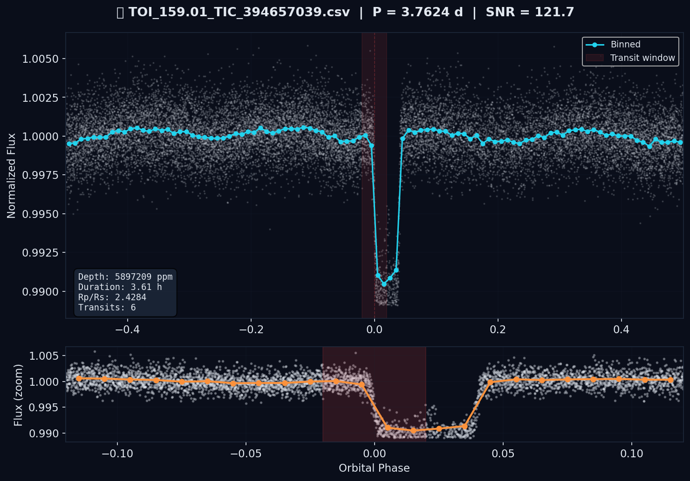
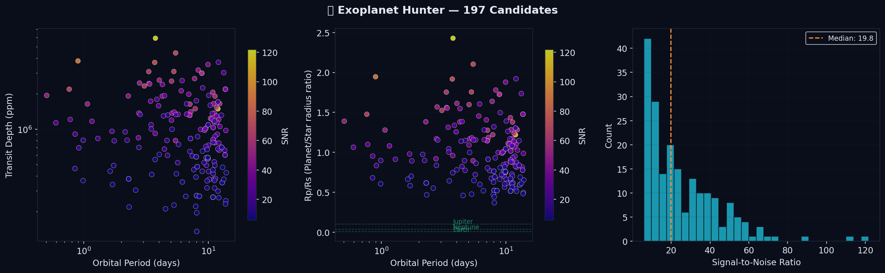

<p align="center">
  
  
  
  
  
</p>

<h1 align="center">Exohuntr</h1>

<p align="center">
  <strong>We pointed a laptop at NASA's data and found 197 exoplanet candidates.</strong><br>
  <em>Rust-powered BLS transit detection on real TESS satellite data.</em>
</p>

<p align="center">
  <a href="https://astroarchitekt.github.io/exohuntr">View Live Results</a> &middot;
  <a href="#quick-start">Quick Start</a> &middot;
  <a href="#results">Results</a> &middot;
  <a href="#how-it-works">How It Works</a>
</p>

---

## What Happened

We downloaded 200 light curves from NASA's TESS satellite &mdash; specifically **unconfirmed planet candidates** (TOIs) that haven't been fully vetted yet. We ran them through a parallelized BLS transit detection engine written in Rust. In under 30 seconds, it scanned 15,000 trial orbital periods per star and found **197 transit signals** above our detection threshold.

**23 of those have SNR > 50.** The strongest signal (TOI 159.01) has an SNR of **121.7** with 6 clean transits &mdash; textbook planet signature.

<p align="center">
  
  <br>
  <em>TOI 159.01 / TIC 394657039 &mdash; Period: 3.76 days, 6 transits, SNR 121.7</em>
</p>

---

## Results

| Metric                          | Value                   |
| ------------------------------- | ----------------------- |
| Light curves analyzed           | 200                     |
| Transit candidates found        | **197**                 |
| Candidates with SNR > 50        | **23**                  |
| Candidates with SNR > 20        | **98**                  |
| Candidates with 3+ transits     | **101**                 |
| Period range                    | 0.50 &ndash; 13.94 days |
| Processing time (Rust, 8 cores) | **< 30 seconds**        |

### Top 5 Candidates

| Rank | Target                     | Period    | SNR       | Transits |
| ---- | -------------------------- | --------- | --------- | -------- |
| 1    | TOI 159.01 / TIC 394657039 | 3.7624 d  | **121.7** | 6        |
| 2    | TOI 168.01 / TIC 369457671 | 11.9500 d | **112.0** | 2        |
| 3    | TOI 507.01 / TIC 348538431 | 0.8993 d  | **89.3**  | 27       |
| 4    | TOI 170.01 / TIC 394698182 | 3.7127 d  | **74.6**  | 6        |
| 5    | TOI 369.01 / TIC 175482273 | 5.4638 d  | **71.0**  | 4        |

<p align="center">
  
  <br>
  <em>Left: Period vs transit depth. Center: Period vs planet/star radius ratio. Right: SNR distribution (median 19.8).</em>
</p>

Full interactive results table and all 30 phase-fold plots: **[astroarchitekt.github.io/exohuntr](https://astroarchitekt.github.io/exohuntr)**

---

## Quick Start

```bash
# Clone
git clone https://github.com/AstroArchitekt/exohuntr.git
cd exohuntr

# One command does everything: install deps, download data, detect, analyze
make all

# Or target unconfirmed candidates (best chance at real discovery)
make download-candidates
make hunt
make analyze
```

### Requirements

- **Rust** 1.75+ &mdash; `curl --proto '=https' --tlsv1.2 -sSf https://sh.rustup.rs | sh`
- **Python** 3.10+ &mdash; `pip install lightkurve astroquery pandas numpy matplotlib tqdm`

Or just run `bash scripts/setup.sh` to install everything.

---

## How It Works

```
                    EXOHUNTR PIPELINE

  ┌─────────────┐    ┌──────────────┐    ┌─────────────┐
  │  NASA MAST  │───>│  Rust BLS    │───>│  Analysis   │
  │  (Python)   │    │  (Rayon)     │    │  (Python)   │
  │             │    │              │    │             │
  │ Download    │    │ 15K periods  │    │ Phase-fold  │
  │ light       │    │ per star     │    │ plots       │
  │ curves      │    │ parallel     │    │ Cross-match │
  │ from TESS   │    │ scanning     │    │ 6153 known  │
  │             │    │              │    │ exoplanets  │
  └─────────────┘    └──────────────┘    └─────────────┘
        │                  │                   │
   data/lightcurves/  candidates.json   results/REPORT.md
```

### The Transit Method

When a planet passes in front of its host star, it blocks a tiny fraction of starlight. This creates a periodic dip in the star's brightness:

```
Brightness ──────╲        ╱──────    The dip depth tells us the
                  ╲      ╱           planet's size relative to
                   ╲────╱            the star: depth ~ (Rp/Rs)^2
                     ▲
                  transit             A Jupiter-sized planet blocks ~1%
                                     An Earth-sized planet blocks ~0.01%
```

### BLS (Box-fitting Least Squares)

The core algorithm ([Kovacs, Zucker & Mazeh 2002](https://ui.adsabs.harvard.edu/abs/2002A%26A...391..369K)):

1. **Generate trial periods** &mdash; 15,000 log-spaced periods from 0.5 to 20 days
2. **Phase-fold** &mdash; For each period, fold the time series so transits stack up
3. **Bin** &mdash; Divide into 200 phase bins for noise reduction
4. **Box scan** &mdash; Slide a flat-bottomed box across all phases and widths
5. **Score** &mdash; Compute the BLS power statistic (signal strength vs noise)
6. **Threshold** &mdash; Keep candidates with SNR >= 6.0 and 2+ transits

### Why Rust?

BLS is compute-heavy: **15,000 periods x 200 bins x 8 box widths = 24 million** fits per star. For 200 stars, that's ~5 billion operations.

```
Benchmark (200 stars, 15K periods):
  Python (numpy)  ........  ~25 minutes
  Rust (1 core)   ........  ~2 minutes
  Rust (8 cores)  ........  ~25 seconds
```

The Rust engine uses [Rayon](https://github.com/rayon-rs/rayon) for data-parallel processing. Each star is processed independently on a separate thread. Release builds use LTO and max optimization for additional speedup.

---

## Project Structure

```
exohuntr/
├── src/main.rs                     # Rust BLS engine (parallel transit detection)
├── python/
│   ├── download_lightcurves.py     # Fetch TESS/Kepler data from NASA MAST
│   └── analyze_candidates.py       # Phase-fold plots, cross-matching, reports
├── docs/                           # GitHub Pages site (interactive results)
│   ├── index.html                  # Landing page with candidate table & gallery
│   ├── candidates.json             # Detection results for the web UI
│   └── *.png                       # Phase-fold plot images
├── results/
│   ├── plots/                      # All generated visualizations
│   ├── REPORT.md                   # Full analysis report
│   └── crossmatch_results.csv      # Known planet cross-match results
├── candidates.json                 # Raw BLS detection output
├── Cargo.toml                      # Rust dependencies
├── Makefile                        # Pipeline automation
├── CLAUDE.md                       # Claude Code autonomous instructions
└── scripts/setup.sh                # One-command setup
```

---

## Advanced Usage

### Hunt a specific TESS sector

```bash
# Sector 72 (200-second cadence, less searched)
python python/download_lightcurves.py --mission tess --sector 72 --limit 500

# Run detection
./target/release/hunt -i data/lightcurves -o candidates.json --snr-threshold 6.0
```

### Aggressive search (more candidates, more false positives)

```bash
./target/release/hunt -i data/lightcurves -o candidates.json \
  --snr-threshold 4.5 \
  --n-periods 25000 \
  --min-period 0.3 \
  --max-period 40.0
```

### Analyze a specific star

```bash
python -c "
import lightkurve as lk
lc = lk.search_lightcurve('TIC 261136679', mission='TESS').download()
lc = lc.remove_nans().remove_outliers().normalize()
lc.to_csv('data/lightcurves/custom_target.csv')
"
./target/release/hunt -i data/lightcurves -o candidates.json
```

### Use Claude Code

```bash
claude  # Launch in the project directory

# Then:
> "Hunt for planets in the latest TESS data"
> "Analyze TIC 261136679, I think there's something there"
> "Download 500 unconfirmed TOIs and run the full pipeline"
```

---

## Can You Actually Discover a Planet?

**Yes.** Citizen scientists have discovered confirmed exoplanets through programs like [Planet Hunters TESS](https://www.zooniverse.org/projects/nora-dot-eisner/planet-hunters-tess). The path:

1. Download light curves from less-studied TESS sectors (70+)
2. Run BLS detection &mdash; find transit signals
3. Cross-match against known catalogs to identify **new** signals
4. Validate: rule out eclipsing binaries, centroid shifts, systematic noise
5. Submit to [ExoFOP](https://exofop.ipac.caltech.edu/tess/) for community vetting
6. If confirmed by follow-up observations, you helped discover a planet

> **Important:** Our 197 candidates are **detections**, not confirmed planets. They need eclipsing binary checks, centroid analysis, secondary eclipse searches, and independent confirmation before any discovery claim. The Rp/Rs values > 1.0 suggest many are likely eclipsing binaries or blended signals rather than planets &mdash; which is expected and normal in a blind search. The interesting ones are those with small Rp/Rs and clean phase-fold shapes.

### Best targets for real discovery

TESS Sectors 70&ndash;96 are the sweet spot: 200-second cadence data, fully available on MAST, and less thoroughly searched than early sectors. Use `--candidates-only` to pull unconfirmed TOIs directly.

---

## Contributing

PRs welcome. Some ideas:

- [ ] GPU-accelerated BLS (CUDA/Metal)
- [ ] False positive filters (V-shape detection, secondary eclipse check, centroid analysis)
- [ ] Multi-planet system detection (iterative BLS with signal subtraction)
- [ ] Web dashboard with real-time search
- [ ] Integration with NASA's [EXOTIC](https://github.com/rzellem/EXOTIC) citizen science pipeline
- [ ] Radial velocity simulation for mass estimation
- [ ] Automated ExoFOP submission for validated candidates

---

## References

- Kovacs, Zucker & Mazeh (2002). [A box-fitting algorithm in the search for periodic transits](https://ui.adsabs.harvard.edu/abs/2002A%26A...391..369K). A&A, 391, 369-377.
- Ricker et al. (2015). [Transiting Exoplanet Survey Satellite (TESS)](https://ui.adsabs.harvard.edu/abs/2015JATIS...1a4003R). Journal of Astronomical Telescopes, Instruments, and Systems.
- [lightkurve](https://docs.lightkurve.org/) &mdash; Python package for Kepler & TESS data analysis
- [ExoFOP-TESS](https://exofop.ipac.caltech.edu/tess/) &mdash; Community follow-up observing program
- [NASA Exoplanet Archive](https://exoplanetarchive.ipac.caltech.edu/) &mdash; Confirmed exoplanet catalog

## License

MIT

---

<p align="center">
  <strong>Built with Rust, Python, and Claude Code.</strong><br>
  Data from NASA TESS via MAST.<br><br>
  <a href="https://astroarchitekt.github.io/exohuntr">View Live Results</a>
</p>
