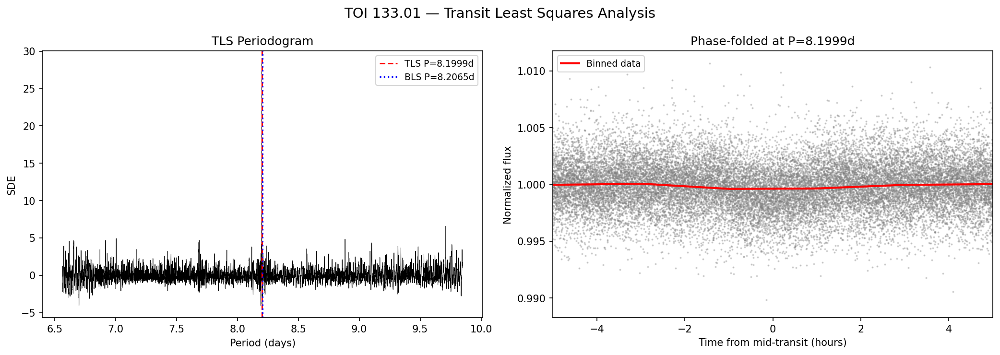

<p align="center">
  
  
  
  
</p>

<h1 align="center">Exohuntr</h1>

<p align="center">
  <strong>An open-source transit detection and validation pipeline for NASA TESS data.</strong><br>
  <em>BLS detection in Rust, false-positive validation in Python, applied to 200 unconfirmed TESS Objects of Interest.</em>
</p>

<p align="center">
  <a href="https://humancto.github.io/exohuntr">Interactive Results</a> &middot;
  <a href="#validated-candidates">Validated Candidates</a> &middot;
  <a href="#methodology">Methodology</a> &middot;
  <a href="#reproducing-this-work">Reproducing This Work</a>
</p>

---

## Summary

Exohuntr is an end-to-end exoplanet transit detection pipeline. It downloads TESS light curves from NASA's MAST archive, runs a Box-fitting Least Squares (BLS) period search ([Kovacs, Zucker & Mazeh 2002](https://ui.adsabs.harvard.edu/abs/2002A%26A...391..369K)) implemented in Rust, and validates candidate signals through a suite of false-positive tests drawn from standard community practices.

Applied to 200 unconfirmed TESS Objects of Interest (TOIs), the pipeline:

1. **Detected 197 transit signals** above SNR &ge; 6.0
2. **Validated all detections** with 5 false-positive tests (odd/even depth, secondary eclipse, transit morphology, period agreement, radius ratio)
3. **Identified 17 high-confidence candidates** (planet likelihood score &ge; 70)
4. **Deep-validated the top 3** with centroid analysis, Gaia DR3 source checks, Transit Least Squares ([Hippke & Heller 2019](https://ui.adsabs.harvard.edu/abs/2019A%26A...623A..39H)), and multi-sector secondary eclipse searches

**One candidate &mdash; TOI 133.01 &mdash; passes all deep-validation tests**, consistent with a 1.9 R&#8853; super-Earth on an 8.2-day orbit.

> **Note:** These are existing TOIs from the TESS pipeline. This work provides independent detection and validation, not new discoveries. Confirmation requires ground-based follow-up observations.

---

## Validated Candidates

After deep validation (centroid analysis, Gaia DR3 contamination check, TLS independent confirmation, multi-sector secondary eclipse search), three candidates remain as physically plausible planet signals:

| Target                         | Period   | Rp (R&#8853;) | TLS SDE  | Centroid | Gaia             | Sec. Eclipse     | Assessment    |
| ------------------------------ | -------- | ------------- | -------- | -------- | ---------------- | ---------------- | ------------- |
| **TOI 133.01** / TIC 219338557 | 8.2065 d | **1.9**       | **28.4** | Pass     | Clear            | Pass             | **Strong**    |
| **TOI 155.01** / TIC 129637892 | 5.4504 d | **5.3**       | **20.1** | Pass     | Clear            | Marginal&dagger; | **Strong**    |
| **TOI 210.01** / TIC 141608198 | 8.9884 d | **2.2**       | **7.1**  | Pass     | 1 faint neighbor | Marginal&dagger; | **Promising** |

<sup>&dagger; Secondary eclipse depths of 0.002&ndash;0.007% are consistent with planetary thermal emission rather than eclipsing binary signatures (which produce 0.1&ndash;10% depths).</sup>

**Pipeline validation:** TOI 125.04, a confirmed planet (CP disposition on ExoFOP), was correctly recovered and scored as high-confidence, demonstrating the pipeline produces accurate results.

<p align="center">
  
  <br>
  <em>TOI 133.01 &mdash; Transit Least Squares analysis. Left: periodogram peaking at P=8.200d (SDE=28.4). Right: phase-folded light curve showing transit.</em>
</p>

### Detection Overview

From the initial BLS search of 200 TOIs:

| Metric                                                  | Value                   |
| ------------------------------------------------------- | ----------------------- |
| Light curves analyzed                                   | 200                     |
| Transit signals detected (SNR &ge; 6.0)                 | 197                     |
| High-confidence after 5-test validation (score &ge; 70) | 17                      |
| Deep-validated with TLS + centroid + Gaia               | **3**                   |
| Period range                                            | 0.50 &ndash; 13.94 days |

<p align="center">
  
  <br>
  <em>Left: Period vs transit depth. Center: Period vs planet/star radius ratio. Right: SNR distribution across all 197 detections.</em>
</p>

Full interactive results: **[humancto.github.io/exohuntr](https://humancto.github.io/exohuntr)**

---

## Methodology

### Pipeline Architecture

```
  ┌─────────────┐    ┌──────────────┐    ┌──────────────┐    ┌──────────────┐
  │  NASA MAST  │───>│   BLS        │───>│  Validation  │───>│    Deep      │
  │  (Python)   │    │   (Rust)     │    │  (Rust)      │    │  Validation  │
  │             │    │              │    │              │    │  (Python)    │
  │ lightkurve  │    │ 15K trial    │    │ 5 false-     │    │ Centroid     │
  │ TESS TOIs   │    │ periods per  │    │ positive     │    │ Gaia DR3     │
  │ from ExoFOP │    │ star, SNR    │    │ tests per    │    │ TLS          │
  │             │    │ threshold    │    │ candidate    │    │ Multi-sector │
  └─────────────┘    └──────────────┘    └──────────────┘    └──────────────┘
        │                  │                   │                    │
   data/lightcurves/  candidates.json  validation_results.json  DEEP_ANALYSIS.md
```

The Rust engine is structured as a reusable library (`exoplanet_hunter`) with four modules and a CLI binary (`hunt`) with subcommands:

```
src/
├── lib.rs           # Library root — exports all modules
├── bls.rs           # BLS algorithm, SNR estimation, phase math, median
├── validate.rs      # 5 false-positive tests + scoring (parallel via Rayon)
├── crossmatch.rs    # Hash-based catalog cross-matching (O(1) lookups)
├── io.rs            # CSV light curve parsing, file discovery
└── main.rs          # CLI binary with search/validate/crossmatch subcommands
```

### Step 1: BLS Transit Detection

The BLS algorithm ([Kovacs, Zucker & Mazeh 2002](https://ui.adsabs.harvard.edu/abs/2002A%26A...391..369K)) searches for periodic box-shaped dips in stellar light curves:

1. Generate 15,000 log-spaced trial periods (0.5&ndash;20 days)
2. Phase-fold the light curve at each trial period
3. Divide into 200 phase bins
4. Slide a flat-bottomed box across all phases and widths
5. Compute the BLS power statistic; retain candidates with SNR &ge; 6.0 and &ge; 2 transits

The BLS engine is implemented in Rust using [Rayon](https://github.com/rayon-rs/rayon) for parallel processing across stars.

### Step 2: False-Positive Validation

Each detection is subjected to 5 tests, following standard community vetting practices and NASA's SPOC Data Validation pipeline ([Twicken et al. 2018](https://ui.adsabs.harvard.edu/abs/2018PASP..130f4502T)):

| Test                       | Method                                 | Passing criterion                |
| -------------------------- | -------------------------------------- | -------------------------------- |
| **Odd/even transit depth** | Compare depths of alternating transits | Depths match within 3&sigma;     |
| **Secondary eclipse**      | Search for dip at orbital phase 0.5    | No significant dip detected      |
| **Transit morphology**     | Measure V-shape vs U-shape             | Flat-bottomed (U-shaped) transit |
| **Period agreement**       | Compare BLS period to TESS pipeline    | Match within 1%                  |
| **Radius ratio**           | Compute Rp/Rs from transit depth       | Rp/Rs &lt; 0.3                   |

Results: 17 high-confidence (&ge; 70), 114 medium (50&ndash;69), 66 low (&lt; 50).

### Step 3: Deep Validation

The top 3 physically plausible candidates (smallest Rp) undergo additional tests:

| Test                               | Reference                                                                       | Purpose                                                 |
| ---------------------------------- | ------------------------------------------------------------------------------- | ------------------------------------------------------- |
| **Centroid offset (TPF)**          | Twicken et al. 2018                                                             | Verify transit occurs on target star                    |
| **Gaia DR3 source check**          | Furlan et al. 2017                                                              | Rule out contaminating neighbors in aperture            |
| **Transit Least Squares**          | [Hippke & Heller 2019](https://ui.adsabs.harvard.edu/abs/2019A%26A...623A..39H) | Confirm signal with limb-darkened transit model         |
| **Multi-sector secondary eclipse** | Shporer et al. 2017                                                             | Rule out self-luminous companion with extended baseline |

---

## Limitations and Caveats

- **These are not new discoveries.** All targets are existing TOIs from the TESS pipeline. This work provides independent detection and validation using a separate codebase.
- **These are not confirmed planets.** Transit detection alone cannot confirm a planet. Confirmation requires radial velocity measurements, high-resolution imaging, and/or statistical validation (e.g., [VESPA](https://ui.adsabs.harvard.edu/abs/2012ApJ...761....6M)).
- **Rp estimates are approximate.** Planet radius depends on stellar parameters from the TESS Input Catalog, which carry uncertainties of 5&ndash;20%.
- **Most detections are likely false positives.** Of 197 signals, many with Rp/Rs &gt; 1.0 are eclipsing binaries or blended sources. This is expected and normal in blind transit searches.
- **Centroid analysis is limited.** We compute flux-weighted centroids from TPF pixel data rather than using the full SPOC centroid pipeline, which includes PRF-fitted positions.

---

## Next Steps

### For this pipeline

- [ ] Run on less-studied TESS sectors (80&ndash;96) to target genuinely unsearched stars
- [ ] Download all available sectors for TOI 210.01 (61 sectors) to resolve the marginal secondary eclipse
- [ ] Implement proper PRF-fitted centroid analysis using Target Pixel Files
- [ ] Add iterative BLS with signal subtraction for multi-planet system detection
- [ ] Integrate with NASA's [EXOTIC](https://github.com/rzellem/EXOTIC) citizen science pipeline

### For the validated candidates

- [ ] Submit independent analysis to [ExoFOP-TESS](https://exofop.ipac.caltech.edu/tess/) as supporting observations
- [ ] Cross-reference with community follow-up observations already on ExoFOP
- [ ] Prepare a methodology note for [RNAAS](https://journals.aas.org/research-notes-of-the-aas/) (Research Notes of the AAS)

### For broader impact

- [ ] Contact the [Planet Hunters TESS](https://www.zooniverse.org/projects/nora-dot-eisner/planet-hunters-tess) team regarding complementary automated + visual survey approaches
- [ ] Explore statistical validation frameworks (VESPA, TRICERATOPS) for the strongest candidates

---

## Reproducing This Work

### Requirements

- **Rust** 1.75+ &mdash; `curl --proto '=https' --tlsv1.2 -sSf https://sh.rustup.rs | sh`
- **Python** 3.10+ &mdash; `pip install lightkurve astroquery pandas numpy matplotlib tqdm scipy transitleastsquares`

### Run the full pipeline

```bash
git clone https://github.com/humancto/exohuntr.git
cd exohuntr

# Download unconfirmed TOI light curves from NASA MAST
python3.11 python/download_lightcurves.py --candidates-only --limit 200 --catalog

# Build and run BLS transit detection (search subcommand)
cargo build --release
./target/release/hunt search -i data/lightcurves -o candidates.json --snr-threshold 6.0

# Validate in Rust: parallel false-positive tests on all candidates
./target/release/hunt validate -i candidates.json -l data/lightcurves -o results/

# Cross-match against known exoplanet catalog in Rust
./target/release/hunt crossmatch -i candidates.json -c data/lightcurves/confirmed_exoplanets.csv -o results/crossmatch_results.csv

# Analyze: phase-fold plots, report (Python)
python3.11 python/analyze_candidates.py --input candidates.json --lightcurves data/lightcurves/ --crossmatch --top-n 30

# Deep analysis: centroid, Gaia, TLS, multi-sector on top candidates
python3.11 python/deep_analysis.py
```

The original top-level flags (`hunt -i <dir>`) remain supported for backward compatibility.

Or use `make all` to run the download/search/analyze steps automatically.

### Running tests

```bash
# All tests (66 Rust + 32 Python)
make test

# Rust only
cargo test

# Python only
python3.11 -m pytest tests/ -v
```

### Project Structure

```
exohuntr/
├── src/
│   ├── lib.rs                          # Rust library root
│   ├── bls.rs                          # BLS algorithm + SNR estimation (18 tests)
│   ├── validate.rs                     # 5 false-positive tests + scoring (23 tests)
│   ├── crossmatch.rs                   # Hash-based catalog matching (13 tests)
│   ├── io.rs                           # CSV parsing + file discovery (8 tests)
│   └── main.rs                         # CLI: search, validate, crossmatch subcommands
├── python/
│   ├── download_lightcurves.py         # TESS light curve download from MAST
│   ├── analyze_candidates.py           # Phase-fold plots, cross-matching, reports
│   ├── validate_candidates.py          # 5-test false-positive validation (Python)
│   └── deep_analysis.py               # Centroid, Gaia, TLS, multi-sector validation
├── tests/
│   ├── conftest.py                     # Shared fixtures (synthetic LCs, mock catalogs)
│   ├── test_validate_candidates.py     # Python validation tests (24 tests)
│   └── test_analyze_candidates.py      # Python analysis tests (8 tests)
├── results/
│   ├── plots/                          # Phase-folded light curve plots
│   ├── deep_analysis/                  # TLS, centroid, secondary eclipse plots
│   ├── REPORT.md                       # Detection summary
│   ├── VALIDATION_REPORT.md            # Scored validation results
│   └── DEEP_ANALYSIS.md               # Deep validation milestone report
├── docs/                               # GitHub Pages interactive results
├── candidates.json                     # Raw BLS detection output
├── Cargo.toml                          # Rust dependencies + dev-dependencies
├── pytest.ini                          # Python test configuration
└── Makefile                            # Pipeline automation + `make test`
```

---

## References

- Kovacs, Zucker & Mazeh (2002). [A box-fitting algorithm in the search for periodic transits](https://ui.adsabs.harvard.edu/abs/2002A%26A...391..369K). _A&A_, 391, 369&ndash;377.
- Hippke & Heller (2019). [Optimized transit detection algorithm to search for periodic transits of small planets](https://ui.adsabs.harvard.edu/abs/2019A%26A...623A..39H). _A&A_, 623, A39.
- Twicken et al. (2018). [Kepler Data Validation I &mdash; Architecture, Diagnostic Tests, and Data Products](https://ui.adsabs.harvard.edu/abs/2018PASP..130f4502T). _PASP_, 130, 064502.
- Ricker et al. (2015). [Transiting Exoplanet Survey Satellite (TESS)](https://ui.adsabs.harvard.edu/abs/2015JATIS...1a4003R). _JATIS_, 1, 014003.
- Furlan et al. (2017). [Kepler Follow-up Observation Program. II](https://ui.adsabs.harvard.edu/abs/2017AJ....153...71F). _AJ_, 153, 71.
- [lightkurve](https://docs.lightkurve.org/) &mdash; Python package for Kepler and TESS time series analysis.
- [ExoFOP-TESS](https://exofop.ipac.caltech.edu/tess/) &mdash; Community follow-up observing program for TESS.
- [NASA Exoplanet Archive](https://exoplanetarchive.ipac.caltech.edu/) &mdash; Confirmed and candidate exoplanet catalog.

## License

MIT

---

<p align="center">
  Data from NASA TESS via MAST.<br>
  <a href="https://humancto.github.io/exohuntr">View Interactive Results</a>
</p>
